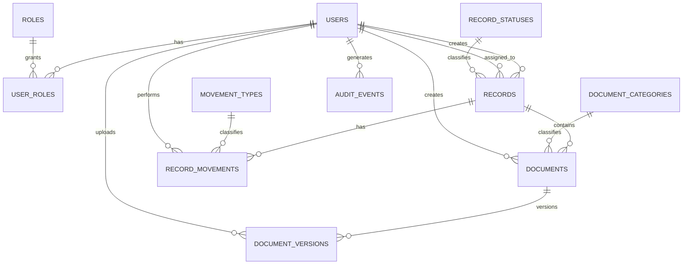

# ArchiveCore conceptual model

## Purpose

This model evolves the original SOF-008 database from isolated `Administrador` and `Usuarios` tables into a normalized document and records management domain.

## Core entities

### User
Represents a person who can authenticate, create records, upload documents, receive assignments and perform workflow actions.

### Role
Represents an authorization profile.

### Record
Represents the logical expediente / registro around which business documents and workflow activity are grouped.

### Document
Represents the logical document associated with a record.

### DocumentVersion
Represents an immutable uploaded version of a document.

### DocumentCategory
Classifies documents without repeating category text in every row.

### RecordStatus
Represents the lifecycle state of a record.

### RecordMovement
Represents a transfer, assignment or other workflow event involving a record.

### MovementType
Catalog of workflow movement types.

### AuditEvent
Captures cross-cutting traceability for important application and database events.

## Relationships

## Legacy mapping

| Legacy concept | ArchiveCore replacement |
|---|---|
| `Administrador` | `Users` + `Roles` + `UserRoles` |
| `Usuarios` | `Users` |
| `IdArchivo` | `Documents` / `DocumentVersions` |
| `IdRegistro` | `Records` |

The legacy identifiers are therefore not copied as unexplained integer columns. They are promoted into first-class relational entities.
